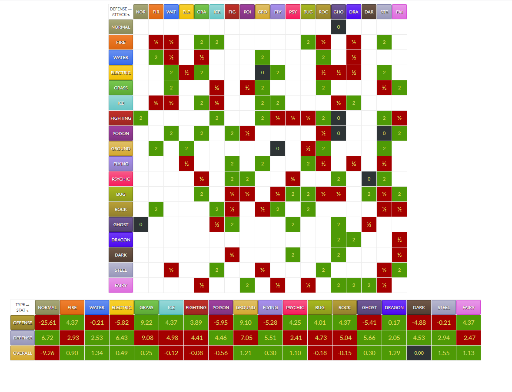

# Benndot's Pokemon Heartgold and Soulsilver

This is a ROM-hacked (custom) version of the Pokemon game Heartgold for Nintendo DS made by me, Benndot. Hi!

Current version: V17.6
Current Task: Test playthrough

Current State: The game should function and play perfectly fine! Most of what I wanted to add/change should be present, though much of it is still untested. Encounters in Johto are ~99% done, and most Pokemon have had their stats and movesets overhauled. Most trainers and all gym leaders have received some tweaks/reworks. Kanto and Mt.Silver are still largely unedited.

## About HG-Engine
HG-Engine is a community-made upgrade to the battle engine in Pokemon HeartGold. It gives the DS an updated roster of Pokemon, abilities, moves and more to bring the 2010 DS game in line with the features of more recent releases in the series. 

It also offers a massive amount of customizability, allowing users to tweak just about every facet of gameplay to their liking. 

## This Project (Overview)

This is a fun little personal project that I've wanted to create for a long time. An attempt at making my own 'definitive' version of one of my favorite games ever. That's 'definitive' by my own definition, and my idea of definitive for this game is pretty eccentric! A lot of what this project consists of is me bringing to life various ideas I've had for Pokemon or gameplay over the years. Some of these are small tweaks to Pokemon stats (I've at least 'tweaked' basically every available Pokemon), but some involve complete reworks of Pokemon and evolutionary lines. It's definitely not an overhaul made for everyone! That said, I think the changes I've made are generally really cool, they make sense, and only improve on the gameplay experience. 

## My Added Features

Here's an overview of the changes/features present in my ROM hack.

-Reworked base stats for all available species. Stat distributions are mostly based on vibes and the Pokemon's appearance rather than having a particular gimmick or gameplay strategy in mind.

-Reworked the level up learnsets (aka the moves that Pokemon learn as they level up) of MANY available Pokemon. While I have completed many dozens, the majority have received little to no editing. The ones that haven't been touched have their HG-Engine default learnsets, which should be their Gamefreak gen 9 (if I'm not mistaken). I've put some real love into the learnsets that I have worked on, and adore how the majority of them have come out. 

-Several Pokemon species have been re-typed. Every typing change that I've made makes as much or more sense than their Gamefreak typing, in my opinion. 

-Several Pokemon species have been giving a new evolution, and/or way of evolving. More details in the evolution changes section in this readme. 

-Reworked every route and dungeon in Johto to change which Pokemon are available where (and at what frequency). My biggest priority was matching the Pokemon species to the environment well, though the variety of Pokemon and spreading of types throughout the region came out really well regardless.  

-Many Pokemon have gotten changes to their species weights and heights. (Changes not reflected in dex entries because that's handled elsewhere. I'd have to figure that out and implement my changes.)

-New type relationships. I reworked how types affect each other to switch things up. I focused heavily both on balance and having these interactions make sense. 

-Evolution methods have been tweaked slightly. I have placed minimum level requirements on Friendship (level 10) and Stone/Item-based (level 20) evolutions. 

-Reworked many battle moves. I've made most moves in general slightly less accurate, and tweaked the power and secondary effect rate of many. Also increased the PP of many moves. 

-Changes to PokeMart and department store inventories and costs. I made PP restoration items added in HG-Engine cheaper, as well as revives and full heals. I added heart scales and eviolite to Poke mart inventories (after hitting certain milestones) for better accessibility. 

-Changes to some trainer's Pokemon selection and levels (early stages)

## Base Stats 

I have gone through and completely reworked just about Pokemon in the game, though Pokemon outside of the main obtainable roster have not been edited. 

The changes made aren't generally too dramatic. I've tailored these new stats to my general impression of the Pokemon species' biology and abilities. Unlike some other reworks, my goal here wasn't really to rework weak Pokemon to be competitively viable and increase parity. 

Some examples of trends in my stat tweak reasoning:

-Gimmick Pokemon are made less gimmicky. 
-Shelled / Exoskeleton-ed Pokemon have buffed defenses in many cases. 
-Blubbery Pokemon tend to be less physically defensive, though sometimes more specially defensive. 

In general I think I've made Pokemon on average a little bit tankier, and a little bit less hard hitting, though there are plenty of exceptions. 

It's by no means a hard science but I put a nice amount of thought into it and I think most of the results are balanced and interesting. 

## Encounters (My changes)

In my version of the game, just about every native evolutionary line in the Pokedex of the first 2 generations can be encountered in the wild. A few select extras from other regions/generations have also been added where I thought appropriate. I really didn't go overboard with it, however.

I tried to thoughtfully spread Pokemon throughout the world. Lots of bugs and grass types in Ilex Forest, More rugged kinds of Pokemon in mountainous areas. I'm pretty happy with how consistent and organized I kept it. There's a nice variety of options wherever you go. More rare 1-2% encounters and a greater variety of Pokemon per route in general due to the density of making all main dex Pokemon available. 

While this information is reliably true for ground encounters, I was a bit more haphazard early on when writing in water encounters. It's possible that there are non-native Pokemon species in certain areas that I missed in editing. It shouldn't be much, if anything, however. 

As of V16.0, I have added my first custom tree/headbutt encounters into the game. 

### Non-native Species Lines Added to Johto

-Surskit
-Wingull
-Mawile
-Sableye
-Nosepass
-Luvdisc
-Relicanth
-Clamperl
-Finneon
-Spoink
-Stunky 
-Snover
-Drifloon
-Carbink
-Togedemaru (via Pikachu evolution)
-Drampa (via Dunsparse evolution)
-Litwick
-Cetoddle
-Pachirisu
-Chatot
-Burmy
-Kecleon
-Flamigo

## Level Up Learnsets (My changes)

I've gone through and edited many Pokemon. As of early November, most of the Pokemon species intended to be present in the game have received extensive updates to their learnsets. However, a decent number still haven't been touched and need to be overhauled (as of October 2024). 

Few to no Pokemon in the game should possess any moves that aren't currently implemented in HG-engine. A select few moves in some movesets may lack animations but their effects should still work in battle. Not ideal, but they should still be functional. 

### The Pokemon evolution lines that I have not yet reworked (Incomplete list): 

* Porygon
* Hitmons
* Fossil species
* Growlithe (revise)
* Eeveelutions (revise)

## Type Matchup Changes

## Species Typing Changes (Incomplete list?)

Bulbasaur & Ivysaur: Mono Grass 
Charizard: Fire / Dragon
Blastoise: Water / Steel
Pidgey & Pidgeotto & Pidgeot: Mono Flying
Hoothoot & Noctowl: Mono Flying
Zubat & Golbat & Crobat: Dark / Flying
Azurill & Marill & Azumarill: Mono Water
Oddish & Gloom: Mono Grass
Nidoran (both kinds): Fighting / Poison
Hypno: Psychic / Dark
Psyduck & Golduck: Water / Psychic
Venonat & Venomoth (renamed Nitenat & Nitemoth): Bug / Dark
Staryu & Starmie: Steel / Psychic
Seel & Dewgong: Normal / Ice
Goldeen: Normal / Water
Rhyhorn: Normal / Rock
Lickitung & Lickylicki: Normal / Poison
Mankey & Primeape: Fighting / Dark
Shellder & Cloyster: Water / Dark
Cubone: Normal / Rock 
Marowak: Dark / Rock
Kangaskhan: Normal / Ground
Heracross: Bug / Normal
Pinsir: Bug / Fighting
Elekid & Electabuzz & Electavire: Fighting / Electric
Smoochum & Jynx: Ice / Fairy
Teddiursa & Ursaring: Fairy / Dark
Sunflora: Grass / Fire
Haunter & Gengar: Ghost / Dark
Magcargo: Mono Fire
Gyarados: Mono Dragon
Golem: Rock / Dragon
Chansey & Blissey: Fairy
Luvdisc: Water / Fairy
Sableye: Rock / Ghost
Masquerain: Bug / Water
Seviper: Poison / Dark
Nosepass & Probopass: Rock / Electric
Pachirisu: Fairy / Electric

## Evolutions and evolution methods (My changes)

This projects adds a few extra evolution options to existing Pokemon for the fun of it. Basically I take Pokemon from other generations who have a resemblance to HGSS Pokemon and give them the ability to evolve into it through one method or another. There's no science to it, it's just a fun little addition based on my headcannon. Ex: Geodude is now capable of evolving into Carkol. 

Long-term, I also intend to create new evolution methods and requirements to existing Pokemon. Nothing crazy, just higher level requirements and in some cases level caps on evolution. Maybe a general held item evolution method that isn't split between day and night. I have already created some of these changes (partially) in a previous project. They need to be transferred over, expanded upon and completed eventually. 

And whether it's existing Pokemon evolutions or evolutions I've added, I've made sure to make the appropriate evolution items available in some way. If I'm not mistaken, all these items should either be purchasable somewhere or be found fairly commonly as a held item on certain Pokemon that make sense. 

### Changes to item utility for Pokemon evolutions 

In order for items to be allowed to be used in the overworld, certain parameters need to be toggled true. 

Since I have multiple items (Twisted Spoons, Macho Brace, King's Rock, Metal Coat, Dragon Scale, Charcoal) that I envision using to evolve Pokemon similarly to how evolutions stones are used, I need to enable them to be used from the menu. These changes are the following:

.fieldUseFunc = 20 (stones seems to use this)
.partyUse = 1
.partyUseParam.evolve = TRUE 

.fieldUseFunc may not be necessary to this, but I haven't tried it without it yet and regardless it doesn't seem to adversely affect anything having it enabled.

### Evolutionary Line Changes

Ekans: Branching evolutions to Arbok and Seviper. (implemented. Untested.)

Geodude: Branching evolutions to Graveler and Carkol.

Dunsparse: Special condition evoluton into Drampa (implemented. Untested.)

Cubone: Branching evolution with Marowak and Kangaskhan (implemented, mostly. Untested.)

Eeveelutions: Eevee's Umbreon, Espeon, and Sylveon evolution methods were changed. Umbreon is obtained via dusk stone, Espeon is obtained via dawn stone, and Sylveon is obtained via shiny stone. (I'd like to add time of day requirements, but they don't exist in the engine's default methods so that won't be done for the time being.)

Drowzee: Evolves by holding a metronome

Gengar: Haunter evolves via Dusk Stone. Gastly is now a separate species with no evolution. 

Pikachu: Added a 'metal coat' induced evolution into a reworked version of Togedemaru (Untested)

Rhyhorn: Is mostly intended to be a single-stage, non-evolving Pokemon (Rhydon-Rhyperior are still accessible by evolving Rhyhorn with a moon stone)

Shellder: Now evolves via normal level up at 36. 

Magikarp: Now requires the use of a dragon scale in order to evolve. (at that evo method's new minimum requirement of level 20, or beyond).

Psyduck: Now requires level up while knowing the move Amnesia. 

Nidoking & Nidoqueen: Now requires the use of a King's Rock (as a stone / held item) rather than the moon stone. 

Sunkern: Evolves by level up while knowing the move Sunny Day.

Pineco: Requires a metal coat to evolve into Forretress.

Bonsly: Evolves at level 18 instead of requiring mimic. 

Wingull: Now evolves on level up only if it knows Stockpile. 

Trade Evolutions: Most have been converted to stone or held item evolutions. The ones that were previous held item trades are now more or less all held item trades.

* Lots of Pokemon who previously evolved by level up still do but at a new level. (Sandshrew level 27, Nidorans level 24, etc.). A more exhaustive list documenting this should probably be made at some point.

### Special Evoluton Conditions Additional Level Requirement (Implemented, mostly!!)

I think all evo methods should have some minimum level condition. 

Since there is none by default for friendship, stone, move knowledge, and party requirement evolutions by default, I have added them in myself. For friendship, I kept it low to 10 for the sake of baby Pokemon. I may create a separate category for them at some point. For the vast majority of the rest I've added a minimum level of 20. 

I'd like to create a higher tier version of each category with a higher level requirement (probably level 35) to cover the handful of Pokemon for which level 20 is too early to reasonably be fully evolved. 

### Party Requirements (Partially implemented)

There are several more evolution requirements that involve having the right Pokemon in your party upon level up. 

Along with the classic example of Mantine & Remoraid, now added to the list is Koffing (Koffing), Diglett (Diglett), Magnemite (Magnemite), Cubone (Kangaskhan), Slowpoke (Shellder).

In the future, I'd like to figure out how to make more than 1 Pokemon requirements as an evo method (ex: Requiring 2 magnemites in party in order to evolve)

## Pokemart stock & value changes 

-Added heart scales and eviolite to normal pokemart inventories (For easy move tutor usage)
-Added items that I use for evolutionary purposes to department store inventories. (twisted spoons, charcoal, dragon scale, metal coat)
-Revives, Ethers and elixirs are much cheaper
-Full Heals are slightly cheaper
-X items (the stat boosters) are cheaper
-Eviolite has been made more expensive for purchase ($1000)
-Fossils have been made purchasable at department stores.

## New fossil revival options

In the post-game, the Pewter city museum allows the player to trade in fossil items from their inventory in order to revive a corresponding Pokemon. Since HG-engine has the benefit of adding fossils,

This feature is entirely untested and there's some reason to think that it may not work without further changes. Confirmation for or against its function will have to wait until proper testing is done. 

The fossil revival mechanic template I used came from a decompilated heartgold repo and can be found here: https://github.com/pret/pokeheartgold/blob/e9f8389b501f79695247eb55ba42649ef5dcf82b/src/scrcmd_fossils.c#L8 

## Where to find my edits 

All the files I've edited and tweaked exist inside of this repository and can be referenced for further details. In this section I'll be giving you the exact paths and files needed in order to find the information. 

(Encounters) For which Pokemon can be encountered where: armips/data/encounters.s. Headbutt encounters are edited separately in their own file located at: armips/data/headbutt.s

(Base Stats, Abilities, Sizes) For changes that I've made to Pokemon's base stats, size data and abilities: armips/data/mondata.s

(Learnsets) For changes that I've made to the lists of moves that each Pokemon can learn as they level up: armips/data/levelupdata.s

(Evolution Data) For changes that I've made to Pokemon's evolutions and how they evolve: armips/data/evodata.s

(Evolution Methods) For changes that I've made to how the methods used to evolve a Pokemon work: src/individual/GetMonEvolutionInternal.c

(Move Data) For changes that I've made to the stats and details of the battle moves themselves: armips/data/moves.s

(Mart Inventories) For changes to what is carried in PokeMarts and department stores: armips/asm/custom/mart_items.s+

(Item Data) For changes to the price of items and what they do: data/itemdata/itemdata.c

(Trainer data) For changes to trainer parties, levels and movesets: armips/data/trainers/trainers.s

(Fossil Revival Options) For my expansions to the fossil-to-pokemon revival mechanic options: armips/asm/custom/scrcmd_fossils.c

(Type Matchups) For my changes to type relationships in battle: src/battle/battle_pokemon.c

## TODO List

* Test added pokemon evolutions. 
* Test new item locations and unlocks (celadon department store, etc.)
* Test expanded fossil revival options in Pewter city
* Work on more species & learnsets that I haven't fully constructed (mienfoo, horsea, porygon line(s), fossil species, seviper etc)
* Test Kanto wild pokemon encounters 
* Work on the post game. Change/test Kanto wild encounters. Make Kanto endgame trainer battles more interesting/challenging. Add friends to mt.Silver.
* Update to a more modern version of HG engine !!!

## Ideas

* Dodrio special evo into Espathra (confirmed modeled, but its pre-evo isn't)
* Add Swablu-Alteria (fairy / flying), castform (mt. silver?)
* Add wild fossil pokemon all around the Cinnabar Island or Pewter area, whichever makes more sense. 
* Add an evolution method with an upper bound, where beyond it they can't evolve (for Clamperl)

## Important Notes / Limitations

HG-Engine has some limits in its current form that effect gameplay in some small ways.

Currently it doesn't support evolution-trigger move learning, which means that I've had to hard code those moves to the expected level of evolution. For that reason I recommend evolving most Pokemon at their earliest level in order to not miss out on a potentially important move.

For Windows users, I recommend Melon DS to emulate this game on. Desmume emulation has some glitches with these ROMs, ranging from relatively minor visual bugs to occasionally game-breaking ones. 

## Base HG-Engine Features:
* Dex Expansion (through Gen 6 almost entirely implemented)
* Ability Expansion (through Gen 6 almost entirely implemented)
* Move Expansion with future generation moves
* Item Expansion with future generation items
* Mega Evolutions + Primal Reversions
* Much More Customizable Trainers
* Fairy Type
* Hidden Abilities
* Updated Effects for Existing [Moves](https://github.com/users/BluRosie/projects/3) and [Abilities](https://github.com/users/BluRosie/projects/2)
* 30 PC Boxes

*A more comprehensive list of features + a roadmap can be found by visiting the [hg-engine wiki](https://github.com/BluRosie/hg-engine/wiki).  

## Disclaimer
 This repository and its assets are a [community endeavor](CREDITS.md).  By its nature, using it and subsequently profiting off of it is profiting on the backs of all of our work, all of which is intended to be used to further hobbies and for everyone to have fun.  You have my blessing to use code and assets from this repository as you please as long as there is *no money involved*, including optional donations through whichever platform to play your hack.  The creations that stem from this repository must be freely accessible and not hidden at all behind any paywall, including those that prompt the player to pay optionally (Ko-Fi's style comes to mind here). 

# Credits
* [**Bubble (Base Mega Code)**][TEMPLATE]
* [**Skeli (FR template)**][CFRU]
* [**PokeDiamond decompilation projects (nitrogfx, msgenc)**][diamond]
* [**Mikelan98, Nomura (ARM9 Expansion Subroutine )**][ARM9]
* Rafael Vuijk (ndstool)

Contributors: Aero, BluRose, Brioche, Charliexox, DavveDP, Dog-Broad, Drayano, Koekenpann, kumakuma1, lhearachel, maxchristy, Mixone, mozzydippers, PandaPanda-Panda, TixoRebel, TurtleIsaac, YGlitzer

[AdAstra](https://github.com/AdAstra-LD/) - `debugsyscall` implementation

Adcroc1 - helping significantly with sprite formatting

BagBoy - dex entries

Barro - swav2swar

Bubble791 - strong basis for where this came from

Chritchy - sprite translation errors bug fix

Dr. Seuss, Zeak6464 - [Pokémon cries from gen 8](https://www.pokecommunity.com/showthread.php?t=432636)

FroggestSpirit - [SDATTool](https://github.com/froggestspirit/SDATTool)

HamsterSkull, wolfang62, nintendoplz, Kyle-Dove, 2and2makes5, PokeGirl4Ever, Fernandojl, Silver-Skie, TyranitarDark, Getsuei-H, Milomilotic11, Kyt66, kdiamo11, ChocoSrawloid, StyleDude, Gallanty, Gizamimi-Pichu, Kid1513, princess-phoenix, Ezerart, DarkusShadow, Anarlaurendil, Lasse00, Boonzeet on deviantart - Overworlds

KazoWAR - BTX-Editor (which is pngtobtx0)

Kingcom - [armips](https://github.com/Kingcom/armips)

MaMe and maple - a lot of mega sprites touched up

Mikelan98 - initial graphics compilation, BDHCAM routine

RH-Hideout Team - cries from gen 9

Shy - platinum Battle BG Insertion tutorial

Smogon Sprite Project, TraviS, LennyBitao, MyMarshlands, DarkusShadow, CarmaNekko, kiriaura, Gnomowladny, Krune, n-kin, JaegerLucciano23, joshr691, Jefelin, MultiDiegoDani, onigin_pixelart, Prodigal96, zerudez, leparagon, arinoelle, diegotoon20, gardow, greyenna, conyjams, kingofthe-x-roads, RayquazaFlygon, metalflygon08 on DeviantArt, and MaMe, maple, Layell, SelenaFF, Sopita Yorita, zlolxd - Pokémon Sprites

WesleyFG and [The Sounds Resource](https://www.sounds-resource.com/3ds/pokemonsunmoon/) - [Pokémon cries from gens 5 through 7](https://www.pokecommunity.com/showthread.php?t=390701)

XLuma - helping get this buildable initially

Game Freak - amazing Pokémon games from way back when

[MONEXPAND]: https://github.com/BluRosie/hgss-monexpansion
[CFRU]: https://github.com/Skeli789/Complete-Fire-Red-Upgrade
[G5T]: https://github.com/CodenamePU/Gen5Tools
[ARM9]: https://pokehacking.com/tutorials/ramexpansion/
[diamond]:https://github.com/pret/pokediamond
[TEMPLATE]: https://github.com/Bubble791/Pokemon-Heart-Gold-Engine
[LUNOS]: https://www.pokecommunity.com/showthread.php?t=432351

## Changelog

### V12.1 

Non-stone evolution items are now usable and should be able to properly evolve eligible Pokemon 